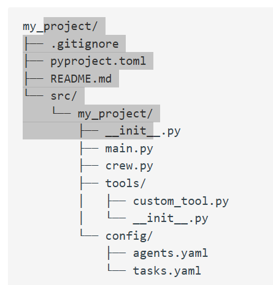

This repository is for crewai demo projects

CrewAI requries Python 3.11 - 3.13

STEP 1: 

Install required packages

```pip instal crewai crewai-tools```

STEP 2: 

Create a virtual environment (dont forget to add to .gitignore)

``` py -m venv env```

STEP 3: 
Switch to environment

```source env/scripts/activate```

STEP 4:
Create a new CrewAI project in your folder

crewai create crew <project name>

This will create a new folder with the following structure: 


You can now edit the files in the src/pmy_project folder